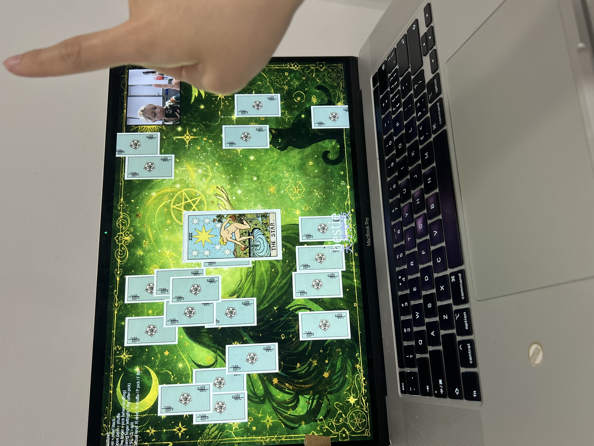
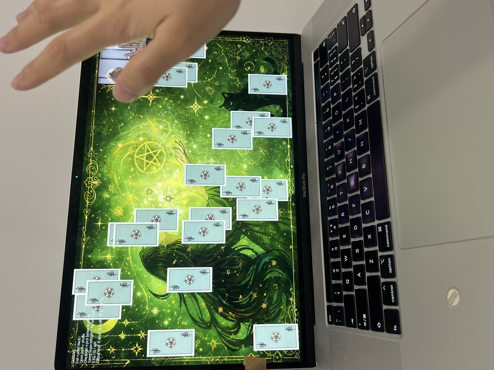
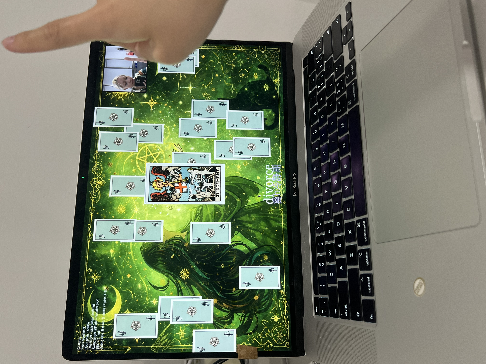

# WCC2 – Creative Coding 2 (2025–26)

Goldsmiths, University of London  
MA Computational Arts  
APBR – Workshops in Creative Coding 2

---

# Feminist Tarot Gesture Prototype

**Name:** Feminist Tarot Gesture Prototype  
**Author:** Siyu Xu  
**Date:** 22 Jan 2026  
**Tech:** Python, Pygame, OpenCV, MediaPipe  
**Input:** Webcam hand gestures  
**Output:** Tarot interaction, hand skeleton overlay, bilingual keywords

---

## Optional blurb

A webcam-based interactive tarot prototype controlled by hand gestures.  
The user shuffles a 22-card Major Arcana deck, picks a card, and flips it using real-time hand landmark tracking.  
After a successful flip, the system displays a poetic English keyword and a Chinese translation for the revealed card.

---

## Project structure

The main project folder is:

```bash
Coding_Feminist Tarot Gesture Prototype/
````

Inside it, the key files are:

```bash id="fjlwm3"
Coding_Feminist Tarot Gesture Prototype/
├── tarot_gesture.py
├── 01.face_landmarks.py
├── 02.hand_landmarks.py
├── 03.pose_landmarks.py
├── cards/
├── fonts/
├── face_landmarker.task
├── hand_landmarker.task
├── pose_landmarker.task
├── imgui.ini
└── tablecloth.jpg
```

---

## Files required to run

Make sure these files exist next to `tarot_gesture.py`:

### `cards/`

This folder must contain:

* `back.png`
* 22 front PNGs named with **0..21** prefixes
  for example:

```bash id="f7253a"
0愚人.png
1魔术师.png
2女祭司.png
...
21世界.png
```

### `fonts/`

This folder must contain:

* `NotoSerif-VariableFont_wdth,wght.ttf`

### Other files

These files should also remain in the same folder as the main script:

* `hand_landmarker.task`
* `face_landmarker.task`
* `pose_landmarker.task`

---

## Instructions (operation manual)

Open Terminal from the **repository root** and run:

```bash id="zv0dob"
cd "Coding_Feminist Tarot Gesture Prototype"
python3 -m venv ../.venv
source ../.venv/bin/activate
python -m pip install --upgrade pip
python -m pip install pygame opencv-python mediapipe numpy
python tarot_gesture.py
```

If the virtual environment already exists, you only need:

```bash id="4xvug6"
cd "Coding_Feminist Tarot Gesture Prototype"
source ../.venv/bin/activate
python tarot_gesture.py
```

**Important:**
This project is currently most reliable when launched from **Terminal** with the virtual environment activated.
In VS Code, the **Run** button may use a different Python interpreter and cause missing-package errors.

---

## Controls

### Hand gestures

* **Fist** → reset stack
* **Open palm** → shuffle / return to shuffle
* **One finger (index only)** → pick a card (only when shuffling)
* **Swing index finger left/right** → flip the selected card (only after pick)

### Keyboard controls

If the camera is unavailable, you can use:

* **R** → reset
* **S** → shuffle
* **P** → pick
* **F** → flip
* **ESC** or **Q** → quit

---

## Visual output

The work includes:

* a full-screen tarot interface
* a webcam preview window
* a visible hand landmark / skeleton overlay
* bilingual text output after a successful card flip

---

## Notes

* This version was tested on **macOS**.
* For Chinese text display on macOS, the code tries to load built-in system fonts such as **PingFang** automatically.
* If Chinese text appears as squares on another operating system, you may need to edit the Chinese font-loading section in the code.
* The project uses a webcam, so camera permission may be required.

---

## Example workflow

1. Start in the central card stack state.
2. Show an **open palm** to shuffle the deck.
3. Show **one finger** to pick a card.
4. Swing the index finger **left/right** to flip the card.
5. Read the English keyword and Chinese translation shown on screen.

---

## Documentation photos

These images document the project running.

### Run 1



### Run 2



### Run 3



---

## Acknowledgements

I acknowledge the use of ChatGPT to generate, debug, and refine parts of the Python code, including webcam capture, MediaPipe hand tracking, gesture logic, and Pygame rendering.

The generated code was then edited, extended, parameter-tuned, and commented by me, and portions of this AI-assisted code are included in the final work.

---

## References

* Python `venv` documentation: [https://docs.python.org/3/library/venv.html](https://docs.python.org/3/library/venv.html)
* MediaPipe documentation: [https://ai.google.dev/edge/mediapipe/solutions/guide](https://ai.google.dev/edge/mediapipe/solutions/guide)
* Pygame documentation: [https://www.pygame.org/docs/](https://www.pygame.org/docs/)
* OpenCV website: [https://opencv.org/](https://opencv.org/)
* Rider–Waite tarot / Pamela Colman Smith Major Arcana imagery